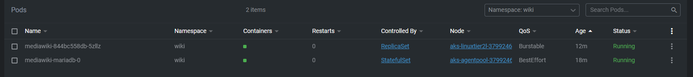
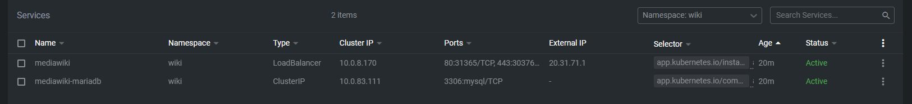
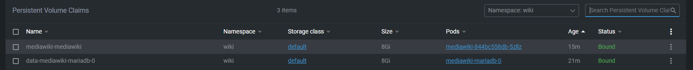
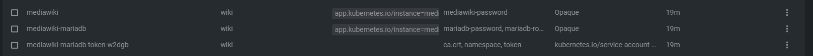
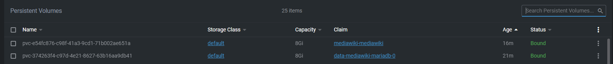
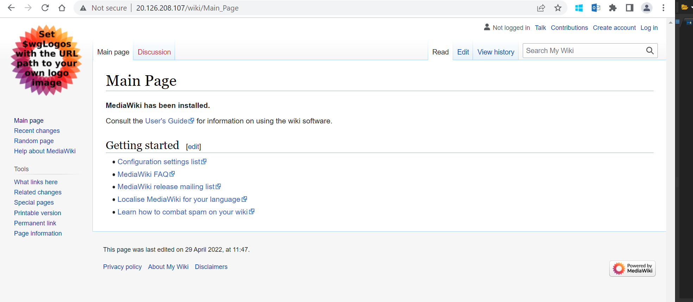

# MediaWiki Kubernetes Deployment

## MEDIAWIKI PROBLEM STATEMENT
 > Automate the deployment of MediaWiki using Kubernetes with Helm Chart/ any equivalent automation.
 
## Solution
### Introduction to MediaWiki
> 
> ***
>  * Open source wiki software that powers Wikipedia
> ***
> 
> ***
> * Scalable software with feature-rich wiki implementation.
> ***
> 


### Deployment Details

***
> Bootstrapped Helm Chart Enable Deployment of MediaWiki and MariaDB in Azure Kubernetes Service (AKS)
***

***
> Terraform Scripts for creating and configuring Azure Kubernetes Service
***

### How to use

#### Terraform

* Change directory to "Infrastructure" folder
```powershell
cd \Assignment\ThoughtWorks\Infrastructure
```
* Update default variables in "**variables.tf**"
```json
variable "location" {
  type    = string
  default = "<location>"
}

variable "subscription_id" {
  type    = string
  default = "<subscription_id>"
}

variable "tenant_id" {
  type    = string
  default = "<tenant_id>"
}

variable "env" {
  type    = string
  default = "dev"
}

variable "default_tag" {
  default = {
    System = "dev"
  }
}

variable "resource_group" {
  type    = string
  default = "<resource-group>"
}
```
* Planning : Terraform configuration to determine the desired state of all the resources it declares.
```powershell
terraform plan
```
* Applying: Applies planned changes 
```powershell
terraform apply
```

#### Above steps will create,
***
>  * Azure Kubernetes Service.
***

>  * Virtual Network and subnet for Azure Kubernetes Service.

***
>  * Select Azure CNI as a networking with Azure Network Policies.
***
>  * Creates System Assigned Identity to provide acces to other Azure resources.
***
>  * Node pool with auto scaling enabled between 3 to 10 nodes.
***

#### Helm Deployment to Azure Kubernetes Service
* Change directory to "MediaWiki_Deployment"
```powershell
cd \Assignment\ThoughtWorks\MediaWiki_Deployment
```
* Update values or provide as arguments to "**deployMediaWiki.ps1**"
```powershell
$SUBSCRIPTION = "<subscription-id"
$RESOURCEGROUP = "<resource-group-name>"
$CLUSTERNAME = "<cluster-name>"
```
* NOTE: Uncomment manditory parameters if wanted to create registry secret. Current deployment will pull open sourced Images.(Use of private registry is recommended for production usage).
Part to uncomment given below,
```powershell
# param(
#     [parameter(Mandatory)] $DockerUserName,
#     [parameter(Mandatory)] $DockerPassword
#      )
```
```powershell
# write-host "--------------------------------------------------------------"
# write-host "CREATE REGISTRY SECRET"
# write-host "--------------------------------------------------------------"
# $secret = kubectl get secret $secretName -n $MediaWikiNameSpace --ignore-not-found

# if ($secret) {
#     Write-Host "$secretName secret already exists, skipping secret creation"
# } else {
#     kubectl create secret docker-registry $secretName --docker-server=<registry-name> --docker-username=$DockerUserName --docker-password=$DockerPassword --docker-email=$DockerUserName -n $MediaWikiNameSpace 
# }
```
* Powershell script is using Bitnami MediaWiki Helm Chart Repository to deploy MediaWiki and MariaDb.
* Deployment of Helm chart is automated and script will provide MediaWiki URL, Username and Password in following format.
```powershell
Mediawiki URL: http://<LoadBalancer-IP>/
Username: user
Password: <password-from-secret>
```
## Results
Scalable Instance of WikiMedia running in secure network Azure Kubernetes Service and exposed out of LoadBalancerIP.

### Kubernetes resources
 
***
##### Pods

***
##### Services

***
##### Persistent Volume Claims

***
##### Secrets

***
##### Persistent Volumes

***

### Running Instance
***

***

### References 
* https://artifacthub.io/packages/helm/bitnami/mediawiki
* https://bitnami.com/stack/mediawiki
* https://github.com/bitnami/bitnami-docker-mediawiki


